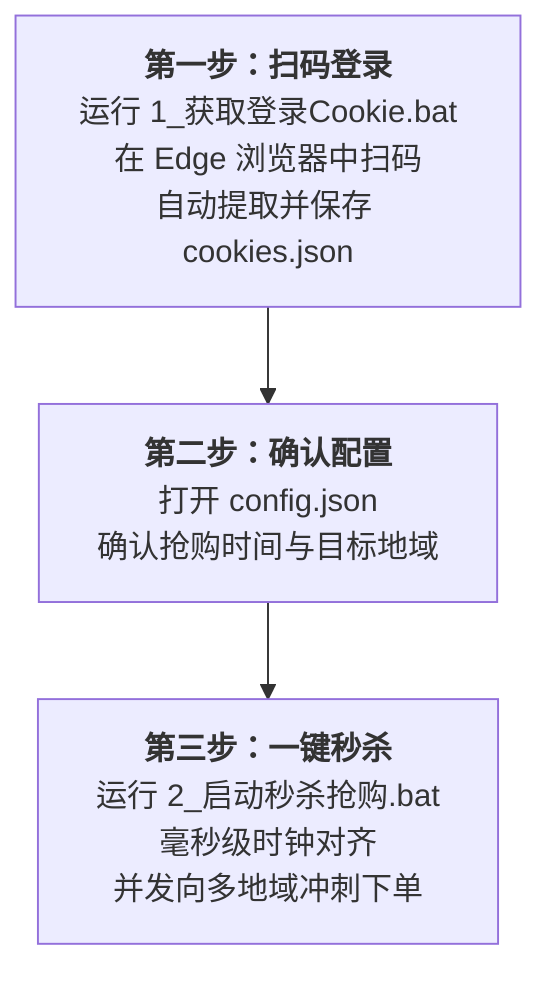

# 🚀 腾讯云服务器秒杀抢购助手 (2026 采购季专版)

> **基于 Python + Playwright 构建的高性能腾讯云服务器自动化秒杀抢购工具**  
> 专为腾讯云限时秒杀活动打造，开箱预置 **2026 采购季 38元/年（4核4G3M）轻量应用服务器** 抢购参数，支持毫秒级时间校准、多地域并发冲刺与智能防风控。


---

## ✨ 核心升级亮点

本项目在原版基础之上进行了深度重构与全面强化，彻底解决了环境部署、鉴权报错与操作繁琐等痛点：

- 🌐 **系统原生 Edge / Chrome 驱动**：自动检测并调起系统自带的 Microsoft Edge 或 Google Chrome 浏览器内核，彻底规避国内网络环境下 Playwright 下载 200MB+ Chromium 经常超时失败的问题。
- 🔐 **内置 DJB2 算法自动生成 CSRF Token**：数学还原腾讯云前端 `x-csrf-token` 哈希推导逻辑，登录后根据 Cookie 实时动态计算，**100% 根除 HTTP 400 `CSRF-ERROR`**，无需手动按 F12 抓包填入！
- 🎯 **开箱预置 2026 采购季活动参数**：内置最新采购季秒杀专区 38 元款（4核4G3M、上海/广州/北京地域）活动及商品 ID，改好时间即可直接开抢。
- ⏱️ **高精度毫秒级时钟对准**：启动时自动抓取腾讯云 API 服务器的 HTTP Date 时间戳，精准计算网络往返时延（RTT）与本地时钟偏差。
- 🧠 **阶梯式自适应倒计时**：远期长周期平滑休眠（防止高频请求导致 IP 被腾讯云风控封禁），临近秒杀前毫秒级 busy-waiting 忙等冲刺。
- 🖥️ **Windows 体验全方位适配**：提供全套一键式 `.bat` 批处理脚本，修正 Windows 换行符（CRLF）与控制台代码页（UTF-8/GBK），杜绝乱码与运行闪退。
- 🛡️ **安全隔离保护**：内置严密的 [`.gitignore`](.gitignore)，个人登录凭据 `cookies.json` 与本地私有参数 `config.json` 自动隔离，提交仓库绝无凭据泄露风险。

---

## 🛠️ 抢购使用流程



---

## ⚡ 快速使用指南（推荐 Windows 用户）

### 第一步：扫码登录获取凭据
双击运行项目根目录下的：
👉 **`1_获取登录Cookie.bat`**

1. 脚本将自动启动系统 Edge 浏览器并打开腾讯云登录页面。
2. 使用微信或腾讯云 App 扫码登录。
3. 登录成功后，脚本会自动识别并写入 `cookies.json`。
4. 提示 `[OK] 成功保存登录凭据至 cookies.json` 后，浏览器将自动安全关闭。

---

### 第二步：确认抢购时间与配置
用记事本或文本编辑器打开 **`config.json`**（初次使用可参考 `config.example.json`）：

```json
{
  "seckill_time": "auto",
  "region_ids": [1, 4, 8],
  "activity_id": 164461404341040,
  "check_act_id": 1897632168296710,
  "buy_act_id": 1897632168296710,
  "bundle_type": "bundle_budget_mc_lg4_01",
  "business_id": 24475,
  "image_id": "lhbp-eqora508",
  "blueprint_id": "LINUX_UNIX",
  "time_span_unit": "12m"
}
```

* **`seckill_time`**：秒杀场次时间。
  * 推荐设为 **`"auto"`**（默认）：脚本将自动根据当前时间匹配下一次秒杀（每天 **10:00:00** 与 **15:00:00** 两场；若当前时间已过 15:00 则自动锁定明天上午 10:00）。
  * 也可手动填入具体时间（如 `"2026-09-23 10:00:00"`）；若填写的历史时间已过期，程序也会贴心自动顺延至下一场。
* **`region_ids`**：抢购的目标地域代码数组（默认 `[1, 4, 8]` 分别对应 **广州 / 上海 / 北京**，并发抢购任一可用地域）。
* 其余商品规格参数已预置为 2026 采购季 38 元轻量服务器配置，保持默认即可。

---

### 第三步：启动秒杀抢购
双击运行：
👉 **`2_启动秒杀抢购.bat`**

脚本将自动执行：
1. **环境检查**：校验 `cookies.json` 与 `config.json` 完整性。
2. **时钟校准**：同步腾讯云官方服务器毫秒级标准时间。
3. **算法自算**：通过内置 DJB2 算法根据登录凭据自动合成 `x-csrf-token`。
4. **智能等待**：进入自适应休眠倒计时，临近抢购时切换至高频并发冲刺。
5. **自动下单**：一旦抢购成功，控制台将输出支付订单号及跳转支付链接。

---

## 💻 命令行运行方式

如果你使用 Linux / macOS 或偏好在终端中操作：

```bash
# 1. 创建并激活 Python 虚拟环境
python -m venv .venv
# Windows:
.venv\Scripts\activate
# Linux/macOS:
source .venv/bin/activate

# 2. 安装依赖
pip install -r requirements.txt

# 3. 扫码登录
python get_cookies.py

# 4. 启动抢购
python snap_up_server.py
```

---

## 📂 项目文件结构

```text
tencentyun-snake-up/
├── 1_获取登录Cookie.bat      # Windows 一键扫码登录脚本
├── 2_启动秒杀抢购.bat        # Windows 一键秒杀主程序
├── 上传到我的GitHub.bat      # 一键同步代码至个人 GitHub 仓库
├── get_cookies.py            # Playwright 驱动登录及凭据自动提取
├── snap_up_server.py         # 核心秒杀模块（时钟校准、DJB2哈希、并发下单）
├── config.json               # 本地抢购参数配置文件（已加入 .gitignore）
├── config.example.json       # 配置参数示例模板（含 2026 采购季 38 元机型参数）
├── requirements.txt          # Python 依赖库清单
├── cookies.json              # 扫码生成的登录鉴权文件（已加入 .gitignore）
├── .gitignore                # Git 忽略配置（防凭据泄露）
├── image.png                 # 项目说明图
└── README.md                 # 详细项目使用说明文档
```

---

## ❓ 常见问题排查 (FAQ)

<details>
<summary><b>Q1: 运行抢购脚本时，控制台提示 <code>NOT-LOGINED</code> 是为什么？</b></summary>

> **解答**：这属于正常现象。腾讯云限时秒杀活动在**非活动开放时间段**，其校验接口 `check-available` 默认就会返回 `NOT-LOGINED` 或活动已结束状态。一旦到达配置的秒杀时间点（如 `15:00:00`），实际执行下单的 `do-goods` 接口会立刻启用真实的登录凭据正常提交订单。
</details>

<details>
<summary><b>Q2: 为什么以前总遇到 <code>HTTP 400 CSRF-ERROR</code>？</b></summary>

> **解答**：腾讯云针对活动接口做了 CSRF 校验机制，需要请求头携带 `x-csrf-token`。旧版脚本由于该字段为空或抓包不全而引发 400 报错。当前版本已在 `snap_up_server.py` 中实现了官方的 **DJB2 哈希散列算法**，能从登录 Cookie 的 `skey` 自动推导计算，完全杜绝了该报错。
</details>

<details>
<summary><b>Q3: 微信扫码成功后，浏览器没有自动关闭怎么办？</b></summary>

> **解答**：当前版本提供了**双重兜底保障**：
> 1. 脚本会持续检测 Cookie 中的关键登录态字段（`uin` 与 `skey`），一旦抓取到即自动判定成功并关闭。
> 2. 如果页面已显示登录成功但脚本仍在轮询，你可以直接在控制台窗口**按下回车键（Enter）**即可手动完成提取。
</details>

<details>
<summary><b>Q4: 我想抢其他配置或别的活动服务器，如何提取参数？</b></summary>

> **解答**：
> 1. 使用 Chrome 或 Edge 打开活动页面并按 `F12` 进入开发者工具，切换到 **Network (网络)** 标签页。
> 2. 在秒杀开始瞬间或点击购买按钮时，找到 `dianshi/do-goods` 请求。
> 3. 查看该请求的 Payload (载荷/请求体)，将里面的 `activity_id`、`buy_act_id`、`business_id`、`bundle_type` 复制并替换到你的 `config.json` 中即可。
</details>

---

## 🔒 安全说明

- 本项目绝不上传、保存或向任何第三方中继服务器发送你的 Cookie、Token 或账号凭据。
- 所有的登录鉴权信息仅保存在你本地的 `cookies.json` 文件中。
- 本仓库已配置严密的 [`.gitignore`](.gitignore)，在向 GitHub 提交代码时会自动屏蔽 `cookies.json` 与 `config.json`，保障个人隐私安全。

---

## 📄 免责声明

1. 本项目仅供 Python 编程学习、网络协议分析及自动化测试研究交流使用。
2. 请严格遵守腾讯云平台的用户协议与使用规范，请勿滥用或用于恶意竞争等违规用途。
3. 使用本项目所产生的一切直接或间接后果，均由使用者自行承担，与项目作者无关。
